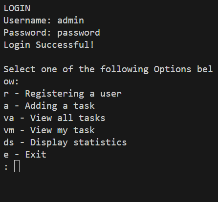
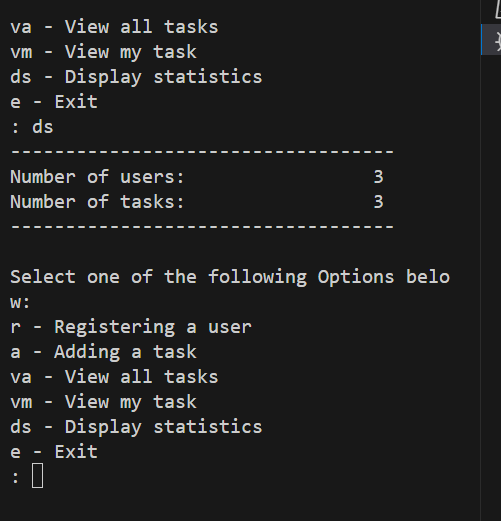

 
# Project Name
Task Manager

# Description
Task Manager is a Python-based project that allows users to manage tasks. It provides functionalities such as user registration, task addition, viewing all tasks, viewing personal tasks, and displaying statistics (for admin users). The project is important as it helps in organizing and tracking tasks, ensuring they are completed within the due dates.

# Table of Contents
1. [Installation](#installation)
2. [Usage](#usage)
3. [Credits](#credits)

# Installation
To install this project locally, follow these steps:

1. Clone the repository to your local machine.
2. Ensure you have Python installed. If not, download and install Python from [here](https://www.python.org/downloads/).
3. Open the terminal/command prompt and navigate to the directory where the project is cloned.
4. Run the `task_manager.py` file by typing `python task_manager.py` in the terminal/command prompt.

# Usage
**Note:** The default admin username is 'admin' and the password is 'password'.
After installing the project, you can use it as follows:

1. Run the `task_manager.py` file.
2. You will be prompted to login. If you are a new user, you can register by selecting the 'r' option.
3. After logging in, you can add a task by selecting the 'a' option, view all tasks by selecting the 'va' option, view your tasks by selecting the 'vm' option, or display statistics (if you are an admin) by selecting the 'ds' option.
4. To exit the program, select the 'e' option.

## Contributing

Pull requests are welcome. For major changes, please open an issue first to discuss what you would like to change.

# Credits
This project is developed by ALC.